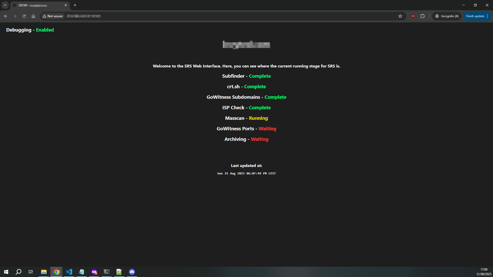

# SRS
Simple Recon Script is a simple bash script designed to perform reconnaissance on websites to aid primarily in web application based security research.

## Used tools
[Subfinder](https://github.com/projectdiscovery/subfinder)\
[crt.sh](https://crt.sh/)\
[GoWitness](https://github.com/sensepost/gowitness)\
[Masscan](https://github.com/robertdavidgraham/masscan)\
[Chromium](https://download-chromium.appspot.com/?platform=Linux_x64&type=snapshots)

## Developed on
Ubuntu 20.04\
Subfinder 2.6.7\
GoWitness 3.0.5\
Masscan 1.0.5\
Chromium 133.0.6836.0\
Bash 5

## Notes
- This relies on you to set up the required tools.
- It's important to note that this is may not work on some systems. For example, certain Bash syntax won't work on other shells like ZSH, or certain tools like sed arguments might not work on non-POSIX systems.
- SRS is primarily designed to be ran inside a Screen session for better productivity. This also prevents session drops from ending the process.
- The Chromium binary location can be changed on line `51`. This is just the better option overall, especially on Ubuntu thanks to Snap. `--chrome-path "$cbp"` can be removed on other distros if Chromium/Chrome is installed via the package manager, but this is untested and could fail.
- This is not advised to use on Ubuntu 23.10 or above thanks to restricted unprivileged user namespaces. This is just to shave down setup time and configuration system side.
- This runs a check to see what ISP owns the IPs that are about to be port scanned. This not only helps to prevent false positives (Cloudflare has every port open), but it also stops time being wasted on things like WAFs and shared hosting. More can be added on line `175` using `; /*HOST*/Id`.
- Running `./srs.sh v` will output the current version. It will then check for a new version.
- Running `.srs.sh TARGET d` will enable debugging. This copies the whole terminal output and preserves files requiring a tool to re-run. This is useful for finding out what's causing an issue, especially in a screen session with a shorter scrollback buffer than the full output.
- The web interface will need a constantly running HTTPD if you're using it with multiple SRS instances. For now, this will only be used for single runs. I recommend reading more in the `Required` section before using SRS.

## Required
### Masscan
As Masscan uses it's own networking stack, you will need root/sudo to run it. Feel free to swap this out for your own port scanner, but do keep in mind to change the way the output is parsed.

Find the binary location using `which masscan`. Use either of the two solutions:
- Add the following to your sudoers file `*USER* ALL=(ALL:ALL) NOPASSWD: *LOCATION*`
- Install `libpcap-dev` and run `sudo setcap cap_net_raw+eip *LOCATION*` -- Recommended as the more "secure" option

Depending on the distro, libpcap-dev might be `libpcap-devel` or just simply `libpcap`.

### Web Interface
As the web interface is currently designed for single SRS instances, there are no checks, so running another instance in unlikely to do much, but could cause output issues. As for now, here are the key points:
- `web.sh` should be placed in the directory you have `srs.sh`. This is expected to be "$HOME/srs" by default, but this can be changed on line `26`.
- For simplicity, the SRSWI utilises Python3's `http.server` module, so Python3 is required.
- The default port is `10101`. This can be changed on line `9`. I recommend using iptables or a firewall to whitelist your IP(s) on whatever port SRSWI uses. Feel free to implement your own solution.
- If SRS has finished or crashed, the HTTP server still running. This is to prevent you from being greeted with server unavailable message. Running SRS again will reset it, or you can just run `bash web.sh stop`.
- Given the nature of SRS, there's no real way to tell if it's hung without putting in a bunch of different checks, especially given bigger targets can take longer. The last page update time is display at the bottom for user judgement.

## To be added
- Create a option in `web.sh` to work with multiple instances of SRS.
- Find or create a better subdomain takeover tool.
- States - States will allow you to continue where you left off if you're performing SRS outside of a screen session, or if there is an abrupt end, such as a crash.
